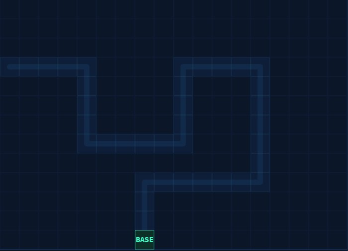
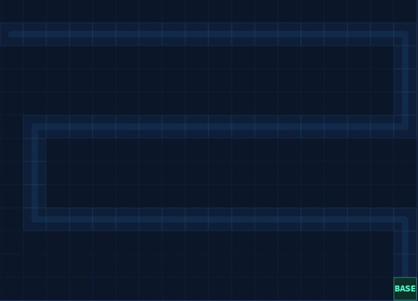
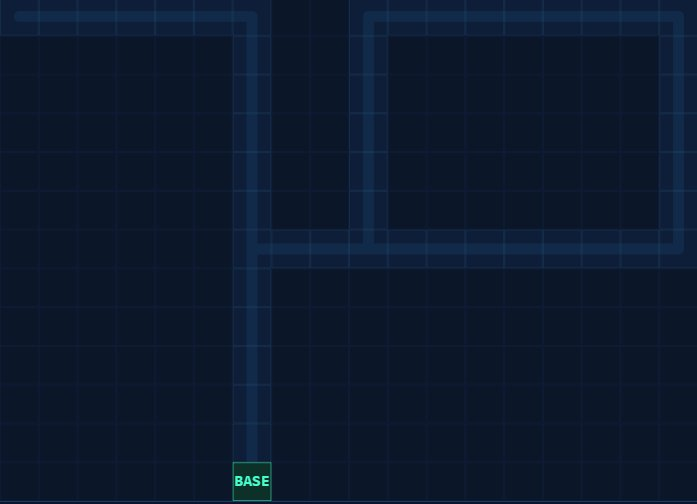

# 🛡️ Defensa Estelar

> Tower defense para web y móvil, inspirado en el clásico **Star Defence** de Java (J2ME).  
> Jugable directo en el navegador — sin instalación, sin dependencias.


---

## 🎮 Jugá ahora

👉 **[LeandroACasco.github.io/defensa-estelar](https://LeandroACasco.github.io/defensa-estelar)**

---

## 📸 Mapas

| Mapa 1 — Zigzag | Mapa 2 — Serpiente | Mapa 3 — Cruce |
|:---:|:---:|:---:|
|  |  |  |
| Camino en S con curvas cerradas | Recorre el mapa en 3 filas | Forma de cruz con intersección |

---

## ⚙️ Características

- 🗺️ **3 mapas** con caminos distintos que progresan automáticamente
- 🔫 **5 torres** con sprites pixel art y 3 niveles de mejora cada una
- 📡 **Sistema de remesas** — enviás créditos entre olas para desbloquear torres
- 👾 **5 tipos de enemigos** — Scout, Trooper, Tank, Speeder y Boss
- 🔊 **Sonidos generados por Web Audio API** — sin archivos externos
- 💥 **Números de daño flotantes** y partículas de explosión
- 📊 **Resumen de ola** con estadísticas detalladas
- 🏆 **Leaderboard online** compartido entre jugadores
- 📱 **Soporte táctil en 2 pasos** para móvil
- ⚡ **Modo velocidad x2**
- 🎨 **Toggle sprites / vectores** en cualquier momento

---

## 🕹️ Cómo jugar

1. **Seleccioná** una torre del panel inferior
2. **Hacé click** (o toque en móvil) en una celda del mapa para colocarla
3. Presá **INICIAR** para comenzar la primera ola
4. Entre olas, **enviá remesas** para desbloquear nuevas torres
5. Completá las **9 olas de cada mapa** para avanzar al siguiente
6. ¡Sobrevivís los **3 mapas** y ganás!

### Torres

| Torre | Costo | Desbloqueo | Especialidad |
|-------|-------|------------|--------------|
| 🔫 Cañón | $50 | Inicial | Uso general, proyectil rápido |
| ⚡ Láser | $80 | $200 remesas | Alta cadencia, disparo instantáneo |
| ❄️ Hielo | $90 | $450 remesas | Ralentiza enemigos |
| 🚀 Misil | $100 | $750 remesas | Daño en área (splash) |
| 🌀 Tesla | $120 | $1100 remesas | Daño en cadena a múltiples enemigos |

### Enemigos

| Enemigo | Velocidad | HP | Peligro |
|---------|-----------|-----|---------|
| Scout | ⚡⚡⚡ | Bajo | Llegan rápido |
| Trooper | ⚡⚡ | Medio | Equilibrado |
| Tank | ⚡ | Alto | Muy resistente |
| Speeder | ⚡⚡⚡⚡ | Bajo | Difícil de alcanzar |
| Boss | ⚡ | Muy alto | Aparece en olas avanzadas |

---

## 🚀 Instalación local

```bash
git clone https://github.com/LeandroACasco/defensa-estelar.git
cd defensa-estelar
open index.html
```

No requiere servidor ni build tools.

---

## 📁 Estructura

```
defensa-estelar/
├── index.html          # Juego completo (autocontenido, ~350KB)
├── README.md           # Este archivo
├── LICENSE             # MIT
└── screenshots/
    ├── map1.png
    ├── map2.png
    └── map3.png
```

---

## 🛠️ Tecnologías

- **HTML5 Canvas** — renderizado del juego
- **Web Audio API** — sonidos generados proceduralmente  
- **JavaScript vanilla** — sin frameworks ni dependencias
- **CSS3** — UI y animaciones

---

## 🎨 Créditos

- Sprites: **Gemini Image Generation**
- Concepto original: **Star Defence** — Glu Mobile, 2004 (Java J2ME)
- Desarrollado con **Claude** (Anthropic)

---

## 📄 Licencia

MIT — libre para usar, modificar y distribuir.

---

<div align="center">
  <b>⭐ Si te gustó el juego, dejá una estrella ⭐</b><br><br>
  <a href="https://github.com/LeandroACasco/defensa-estelar">github.com/LeandroACasco/defensa-estelar</a>
</div>
